# fuck-keil-guide（现代化嵌入式软件开发指南）

## 前言

换用GNU工具链的理由很显而易见。Keil这种生态割裂的专有软件对代码规范化和系统化管理的危害有目共睹。

- 计划做的框架要简化调车的过程，但是最后权衡利弊却还是只能用C语言，因为Keil对C++支持稀烂。软件工程、设计模式在C语言的框架下完全施展不开，虽然代码的抽象程度有进步但是远不如专门的面向对象语言来的直观。

- 队里推广了git版本管理，但是Keil的工程文件不是人类可读的，而且时不时就会变一下，污染commit记录。试想如果未来要进行code review，这样完全不能让人接受。

- 编辑器难用。补全迟缓，没有自动格式化，搜索功能和记事本一样原始。

- CI/CD在Keil平台上完全没法进行。

- 硬要扯的话，它是收费软件，破解还得费一些心思。

虽然它确实有一些不得不承认的优点，比如调试功能很好用；但是它的缺点也都是致命的。并且它的优点并不是一骑绝尘，没有任何替代品。其他很多学校，比如广工的CI/CD流水线为他们省下了大量的沟通和调试时间。要跟上时代享受这些新技术带来的便利，就不得不抛弃Keil，转向嵌入式之外几乎所有其他领域C/C++开发者都在广泛应用的GNU工具链。

本文会简要介绍使用GNU工具链进行现代化嵌入式软件开发的方法。因为个人喜好和客观上这一套东西确实比较方便，所以只使用`STM32CubeMX`+`GNU Arm Embedded Toolchain`+`CLion`+`CMake`+`OpenOCD`+`SEGGER Ozone`进行介绍。*然而我相信只要学会了这一套，肯定就会意识到工具的组合是无穷无尽的，也就不在乎到底是用什么编辑器写代码，或者到底用什么调试器调试了。*

~~*CMSIS-DSP等一系列CMSIS库原生支持的就是用CMake构建。ARM的工程师都不用Keil你为什么还用？(懒得喷.jpg)*~~

## 前置知识

- CMake
- GNU C/C++工具链。

这两样可以不熟但是一定要会用，本文假设读者熟悉桌面平台上使用CMake管理的C/C++工程构建过程，不会提平台无关的关于CMake的一些常见问题。

不会也没关系，学起来很简单。找个CMake教程看看就好。

## 复习一下：C/C++工程构建

无论在什么平台上构建C/C++代码，都是经过`源代码->目标文件->可执行文件`三步。编译器把源代码(`.c`)编译成目标文件(`.o/.obj`)，链接器把代码编译出的一大堆目标文件(`.o/.obj`)和库(`.a/.lib/.so/.dll`)链接在一起，生成一个或者几个可执行文件(`/.bin/.elf/.exe`)或库(`.a/.lib/.so/.dll`)。

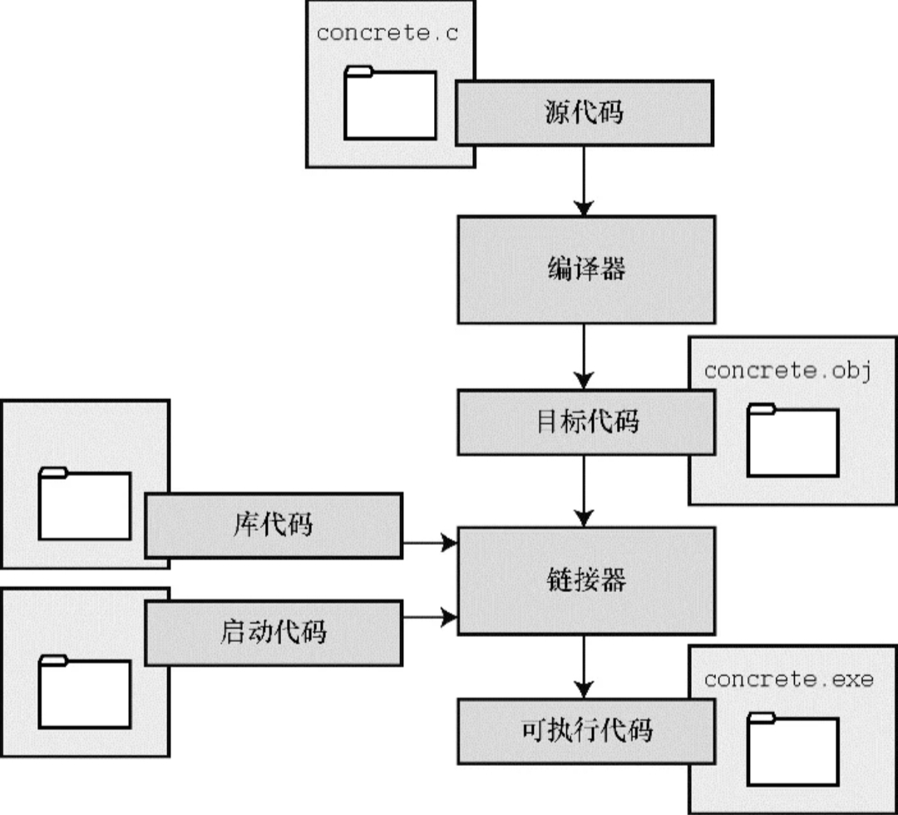

观察各种C/C++工具链，都可以看见编译器和链接器这两样东西。依次把源代码送进这两样东西，就可以得到想要的可执行文件。

MSVC: `cl` `link`

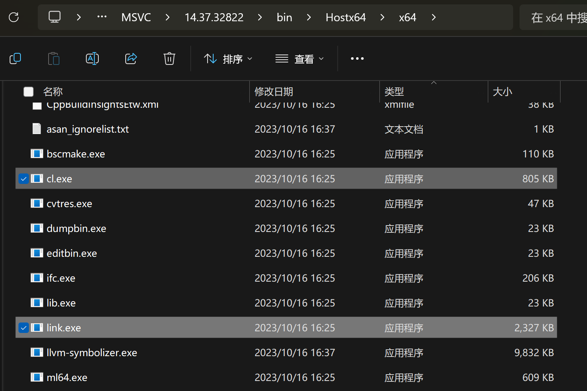

GCC: `gcc` `g++` `ld`

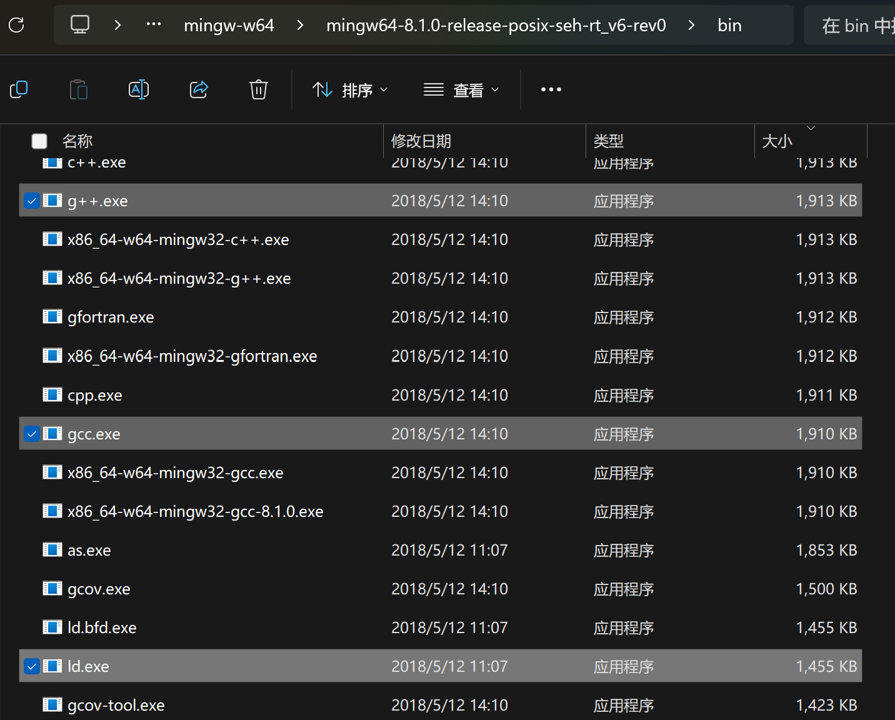

还有Keil老登自带的工具链: `armcc` `armlink`


项目庞杂的情况下，就要一个一个文件编译，再把一大堆.o文件拷到一起链接。——正常人类应该都不会这样搞，而是用构建系统自动化这个过程。今天一般用的是`CMake`和`make`。在C/C++项目根目录下经常可以看到`CMakeLists.txt`文件，`CMake`会根据这个文件生成`Makefile`，`make`会根据`Makefile`自动编译和链接。这样就不用手动一个一个文件编译和链接了。

IDE所做的就是进一步把这个过程变简单，把仍然有点复杂的好几行长的cmake命令变成几项工程设置和一个build按钮。

## 嵌入式平台的C/C++工程构建

嵌入式平台上的C/C++工程构建没有特殊之处，和上述过程一模一样，只不过使用可执行文件的方式有所不同：桌面平台直接运行调试就好，而嵌入式平台需要把可执行文件烧录到目标设备上，然后用调试器调试。Keil把完成整个过程必要的工具都自动安装配置好了，让开发者不用操心单独安装这些东西。然而它自带的东西都是专有的，而且基本都非常难用。我们完全可以松松绑，去找其他更好的选择。

**总结一下，整个开发流程一共需要六样东西：文本编辑器/IDE、编译器、链接器、构建系统、烧录工具和调试器。**

### 文本编辑器/IDE

如果你对本文介绍的整个流程已经非常熟悉了，那就随便选一个喜欢的编辑器吧！

**但是！！**

如果是初见的话就用JetBrains的`CLion`，它可以根据CubeIDE工程自动生成CMakeLists.txt，不用自己写。这个文件写起来比较复杂，后续再学。而且它和CMake的整合做的也很完美。

### 交叉工具链(编译器和链接器)

用[GNU Arm Embedded Toolchain](https://developer.arm.com/downloads/-/arm-gnu-toolchain-downloads)。这几乎就是嵌入式版的GCC，用起来比较熟悉，资料也比较多。还有一个选择是`LLVM/Clang`，本文不介绍；再极端点，Keil自带的`ARMCC`也可以很好的融入这套工作流，但是何必呢。。。

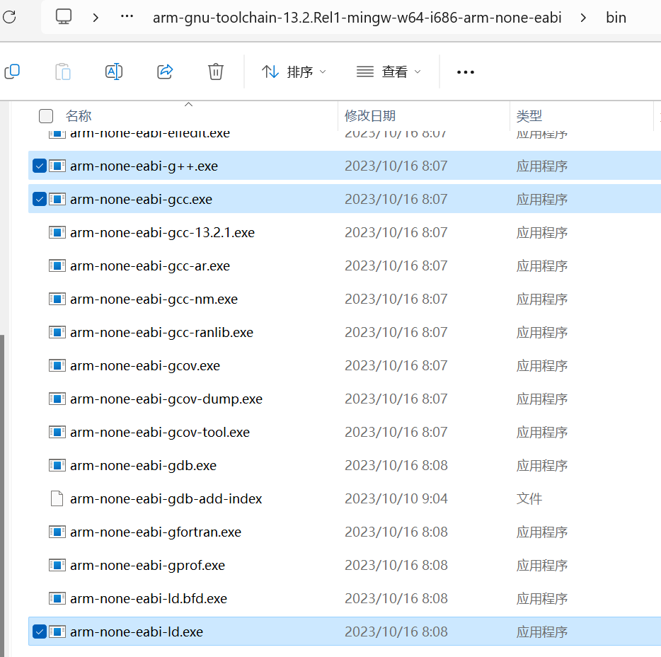

↑ 和GCC基本长得一模一样。一个GNU工具链中包含很多工具，但是不了解其实不影响使用，CMake会自动调用这些工具。

在GNU Arm Embedded Toolchain里，这些标准的GNU工具都加上了`arm-none-eabi-`前缀，比如`arm-none-eabi-gcc`、`arm-none-eabi-g++`、`arm-none-eabi-ld`等等。这样就算加到了环境变量里也不会和系统自带的GCC冲突。

### 构建系统

我们用[`CMake`](https://cmake.org/download/)+[`Ninja`](https://github.com/ninja-build/ninja/releases)。`Ninja`是一个比`make`更快的替代品，两者用法基本一样，只是`Ninja`编译速度更快。（**很快！！**）

如果用CLion的话就不用管，它自带CMake和Ninja。

### 烧录工具

[`OpenOCD`](http://openocd.org/getting-openocd/)启动！

### 调试器

选择很多，我主观觉得最好用的是`SEGGER Ozone`，或者`Cortex-Debug`(VSCode插件)+`GDB`+`OpenOCD`的组合。这里第二种方式不介绍，可以自行搜索。

Ozone只有几个特定的版本支持DAP调试器。感谢湖南大学跃鹿战队找到了能用的版本并且分享出来。跟着他们的教程可以秒上手：https://zhuanlan.zhihu.com/p/584915369

## 上工！

要用到的所有工具就是上述这些，把它们都安装好，开始工作吧！（怎么安装自己搜:O）

这里额外讲一下怎么在CLion里配置工具链。配置好之后才可以开始使用。

打开CLion，进入`File`->`Settings`->`Build, Execution, Deployment`->`Toolchains`，添加一个新的`System`工具链。设置好C、C++编译器的路径，如果Ninja没有被自动检测到，也手动设置一下。然后保存。

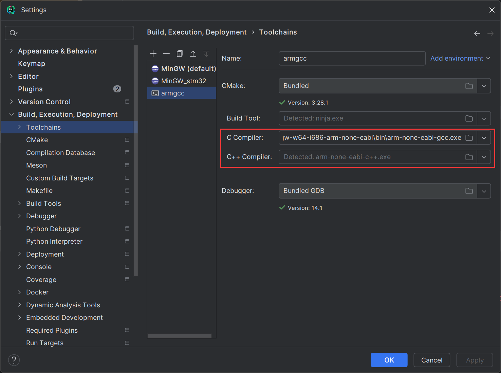

1. 像往常一样用CubeMX生成工程，注意要选择生成`STM32CubeIDE`的工程。

2. 在IDE里打开工程文件夹，在根目录下编写CMakeLists.txt。

    - 如果是CLion就不用写了，它会弹出一个选择开发板的小窗口。选择skip或者直接关掉，工程根目录下就会自动生成一个CMakeLists.txt，再然后CLion会自动进行Configure。如果一切正常，文件结构就会像下面这样：

        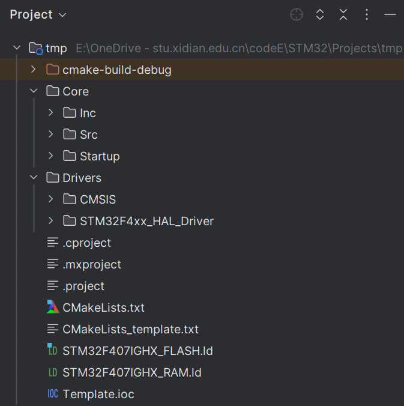

        如果你比较熟悉CMake的话，就会发现这不就是一个标准的CMake工程吗？！意识到这一点，就说明我们发现其实用什么东西写代码已经不重要了，只要编辑器或IDE对CMake有做整合，用它写代码的体验就不会太差。
  
        **重要：打开CMakeLists.txt，找到两个地方，注释写着：`Uncomment for hardware floating point`和`Uncomment for software floating point`。任选其一取消注释，保存，然后重新加载工程。**

        这里贴出来整个文件简要介绍下需要重点关注的地方，阅读时可以结合本来就有的英语注释帮助理解：

        ```cmake
        #THIS FILE IS AUTO GENERATED FROM THE TEMPLATE! DO NOT CHANGE!
        set(CMAKE_SYSTEM_NAME Generic)
        set(CMAKE_SYSTEM_VERSION 1)
        cmake_minimum_required(VERSION 3.28)

        # specify cross-compilers and tools
        set(CMAKE_C_COMPILER arm-none-eabi-gcc)
        set(CMAKE_CXX_COMPILER arm-none-eabi-g++)
        set(CMAKE_ASM_COMPILER  arm-none-eabi-gcc)
        set(CMAKE_AR arm-none-eabi-ar)
        set(CMAKE_OBJCOPY arm-none-eabi-objcopy)
        set(CMAKE_OBJDUMP arm-none-eabi-objdump)
        set(SIZE arm-none-eabi-size)
        set(CMAKE_TRY_COMPILE_TARGET_TYPE STATIC_LIBRARY)

        # project settings
        project(Template C CXX ASM)
        set(CMAKE_CXX_STANDARD 17)
        set(CMAKE_C_STANDARD 11)

        # 这里必须任选其一，不能同时取消注释或者都注释掉
        #Uncomment for hardware floating point      # 把下面这三行取消注释，就是硬件浮点（前提是芯片支持硬件浮点）
        #add_compile_definitions(ARM_MATH_CM4;ARM_MATH_MATRIX_CHECK;ARM_MATH_ROUNDING)
        #add_compile_options(-mfloat-abi=hard -mfpu=fpv4-sp-d16)
        #add_link_options(-mfloat-abi=hard -mfpu=fpv4-sp-d16)

        #Uncomment for software floating point      # 把下面这三行取消注释，就是软件浮点
        #add_compile_options(-mfloat-abi=soft)

        add_compile_options(-mcpu=cortex-m4 -mthumb -mthumb-interwork)
        add_compile_options(-ffunction-sections -fdata-sections -fno-common -fmessage-length=0)

        # uncomment to mitigate c++17 absolute addresses warnings
        #set(CMAKE_CXX_FLAGS "${CMAKE_CXX_FLAGS} -Wno-register")

        # Enable assembler files preprocessing
        add_compile_options($<$<COMPILE_LANGUAGE:ASM>:-x$<SEMICOLON>assembler-with-cpp>)

        # 优化等级，根据CMAKE_BUILD_TYPE变量决定-Ofast -Og -Os。代码最终上车的时候一定要用Release模式编译。
        if ("${CMAKE_BUILD_TYPE}" STREQUAL "Release")
            message(STATUS "Maximum optimization for speed")
            add_compile_options(-Ofast)
        elseif ("${CMAKE_BUILD_TYPE}" STREQUAL "RelWithDebInfo")
            message(STATUS "Maximum optimization for speed, debug info included")
            add_compile_options(-Ofast -g)
        elseif ("${CMAKE_BUILD_TYPE}" STREQUAL "MinSizeRel")
            message(STATUS "Maximum optimization for size")
            add_compile_options(-Os)
        else ()
            message(STATUS "Minimal optimization, debug info included")
            add_compile_options(-Og -g)
        endif ()

        # 如果后续有需要，在这里设置包含路径
        include_directories(Core/Inc Drivers/STM32F4xx_HAL_Driver/Inc Drivers/STM32F4xx_HAL_Driver/Inc/Legacy Drivers/CMSIS/Device/ST/STM32F4xx/Include Drivers/CMSIS/Include)

        add_definitions(-DDEBUG -DUSE_HAL_DRIVER -DSTM32F407xx)

        # 如果后续有需要，在这里添加源码文件
        file(GLOB_RECURSE SOURCES "Core/*.*" "Drivers/*.*")

        set(LINKER_SCRIPT ${CMAKE_SOURCE_DIR}/STM32F407IGHX_FLASH.ld)

        add_link_options(-Wl,-gc-sections,--print-memory-usage,-Map=${PROJECT_BINARY_DIR}/${PROJECT_NAME}.map)
        add_link_options(-mcpu=cortex-m4 -mthumb -mthumb-interwork)
        add_link_options(-T ${LINKER_SCRIPT})

        # 如果需要用到第三方库，在这个位置使用add_subdirectory和link_libraries。

        add_executable(${PROJECT_NAME}.elf ${SOURCES} ${LINKER_SCRIPT})

        set(HEX_FILE ${PROJECT_BINARY_DIR}/${PROJECT_NAME}.hex)
        set(BIN_FILE ${PROJECT_BINARY_DIR}/${PROJECT_NAME}.bin)

        add_custom_command(TARGET ${PROJECT_NAME}.elf POST_BUILD
                COMMAND ${CMAKE_OBJCOPY} -Oihex $<TARGET_FILE:${PROJECT_NAME}.elf> ${HEX_FILE}
                COMMAND ${CMAKE_OBJCOPY} -Obinary $<TARGET_FILE:${PROJECT_NAME}.elf> ${BIN_FILE}
                COMMENT "Building ${HEX_FILE}
        Building ${BIN_FILE}")

        ```

    - 如果你用的是其他IDE，或者想知道CLion自动生成的CMakeLists.txt里面每一行都是什么意思，就要手动写一写CMakeLists.txt。Github上[有一篇教程](https://github.com/MaJerle/stm32-cube-cmake-vscode)教你怎么写STM32工程的CMakeLists.txt，可以学习一下。

3. 写代码。和用Keil写没什么区别。（但是会爽很多——）

4. 编译。在CLion里点一下build按钮，或者进入build文件夹在命令行里`cmake --build .`。

    - 为了保持对`make`的兼容性，尽管CLion默认使用`Ninja`构建，默认选项仍然是让CMake生成Unix Makefile。然而在今天这个选项已经是deprecated了。由于我们不需要对`make`向下兼容，所以直接改为生成ninja文件。在`File`->`Settings`->`Build, Execution, Deployment`->`CMake`里把`Generator`改成`Ninja`。

    - 如果你在CLion里配置了很多个工具链，也要在这个界面把工程使用的工具链改成刚刚配置的那个。在Generator选项上面有一个`Toolchain`选项，选择刚刚配置的那个。

        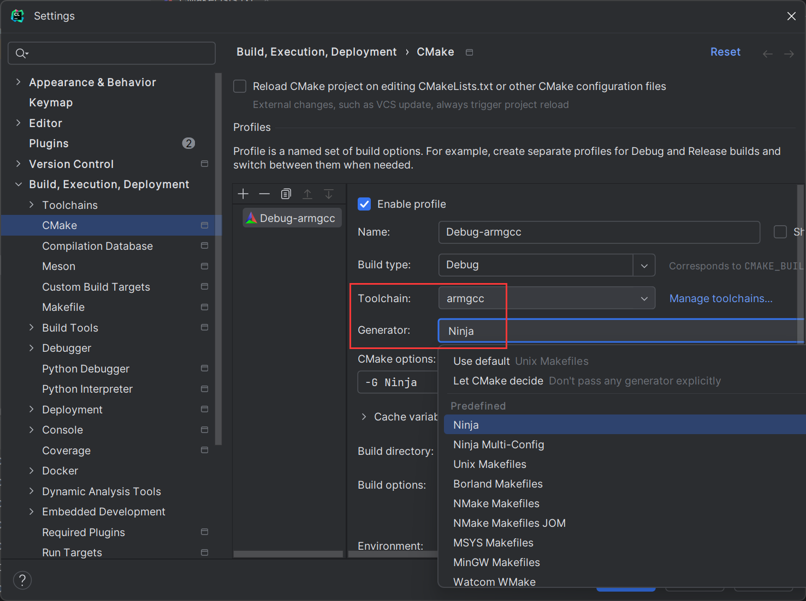

5. 一切顺利的话，Run窗口就会提示`Build finished`，并且展示RAM和FLASH的占用情况。build文件夹里也会出现编译好的`.elf`、`.hex`和`.bin`文件。

    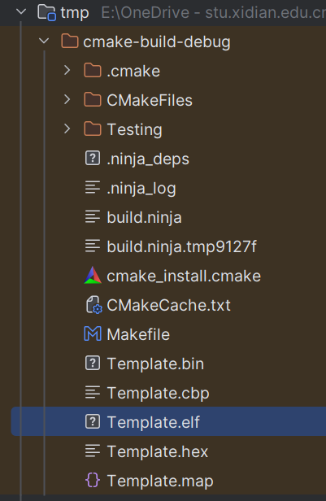

    现在，我们要用`OpenOCD`把`.elf`文件烧录到目标设备上。CLion又展示出它的强大之处，因为它对`OpenOCD`也有良好的支持。像下面这样配置好`OpenOCD`，然后点击`Run`按钮即可烧录。

    1. 保证`OpenOCD`已经加到了环境变量里，可以在命令行里输入`openocd -v`验证

    2. 添加一个`OpenOCD`的`Run Configuration`

        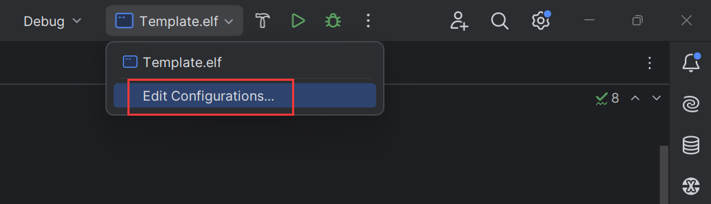

        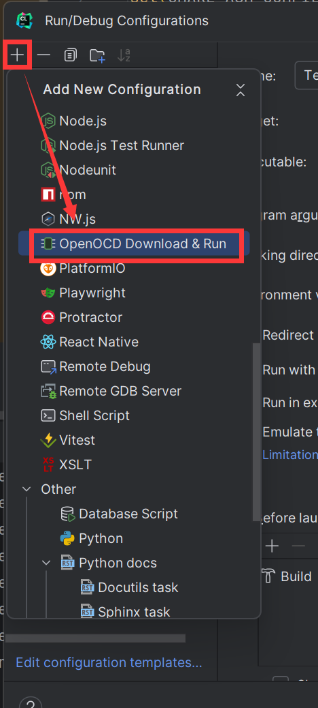

    3. 设置要烧录的固件，填写`OpenOCD`的配置文件路径。

        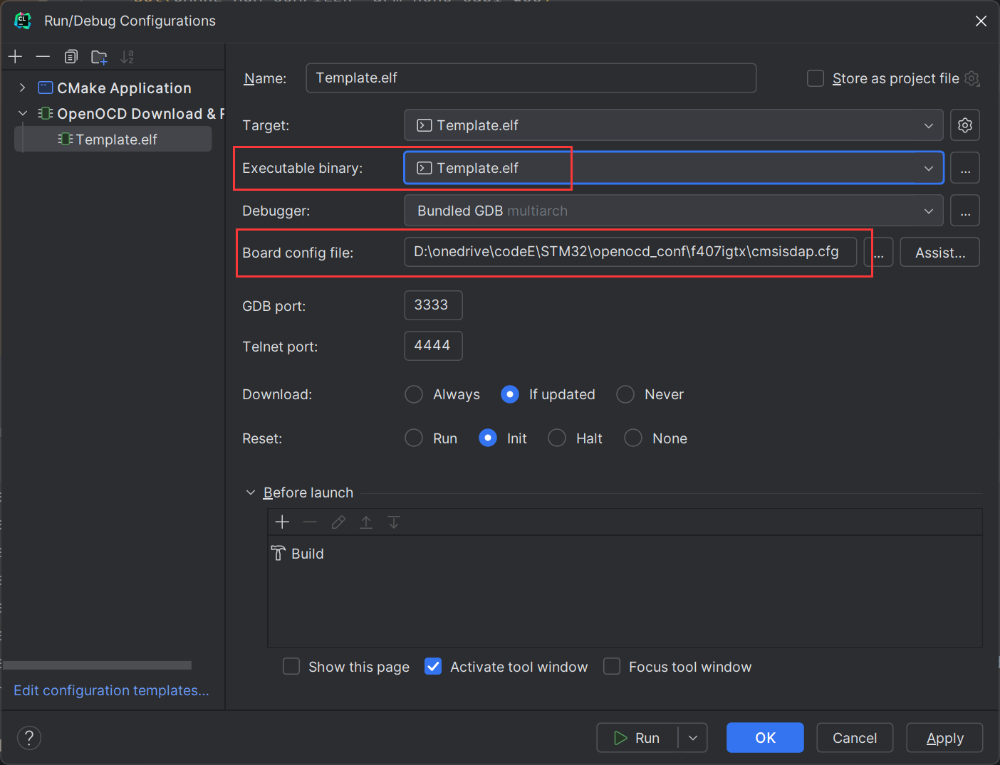

        关于这个配置文件：这个配置文件指定了要使用`什么调试器`烧录到`FLASH多大`的`什么设备上`。使用CMSIS-DAP调试器烧录STM32F4的配置文件如下：

        `cmsisdap.cfg`
        ```
        # choose st-link/j-link/dap-link etc.
        adapter driver cmsis-dap
        transport select swd

        # 0x20000 = 128K Flash Size
        set FLASH_SIZE 0x20000

        source [find target/stm32f4x.cfg]

        # download speed 10MHz
        adapter speed 10000
        ```

        要用其他调试器烧录其他芯片可以自行搜索学习，五分钟学会。

    4. 选择刚刚新建的`Run Configuration`点击运行，等待烧录完成。

        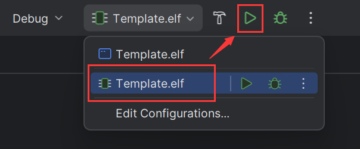

    - 如果你不用CLion，或者想深入学习`OpenOCD`，可以参考[这篇教程](https://cloud.tencent.com/developer/article/1840792)。

6. 此时按下板子上的reset按钮，会发现程序已经跑起来了。点击运行旁边的调试按钮，也可以正常调试。但是这个调试功能仍然在开发中，不能实时查看变量的变化情况([CPP-22056](https://youtrack.jetbrains.com/issue/CPP-22056/Watch-variables-and-memory-in-realtime))，非常不好用。所以暂时用`SEGGER Ozone`作为替代。等未来CLion的这个功能开发完成，它就是嵌入式开发的神:)))))。`Ozone`的使用方法本文不介绍，请参考上面贴出的湖南大学跃鹿战队的教程。

## 完

至此，整个开发流程已经打通。现在，我们有了很多以前不能有的能力。

- 在工程里新建一个C++文件，不需要任何额外配置就可以和C混合编译。

- `GNU Arm Embedded Toolchain`的开发和维护非常活跃，可以随意使用现代C++20甚至C++23的新功能。

- 由于本质上整个工程是一个CMake工程，很多现代软件开发的方法都可以直接拿来用。模块化、CI/CD等等做起来都变得很方便。

- 可以随意选择代码编辑器，VSCode、CLion等软件强大的功能会成倍提高开发效率，还会让代码变得更整洁易读。