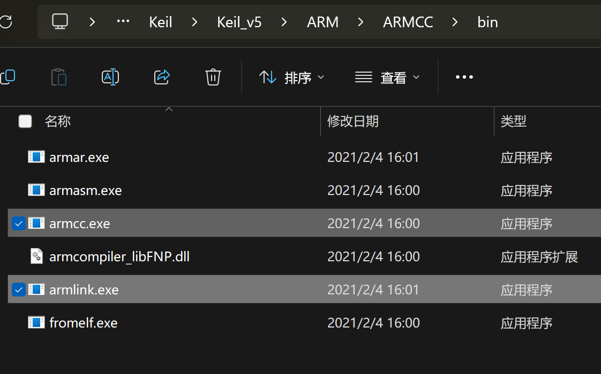

# fuck-keil-guide（现代化嵌入式软件开发指南）

## 前言

换用GNU工具链的理由很明显。Keil这种生态割裂的专有软件对代码规范化和系统化管理的危害有目共睹。

- 计划做的框架要简化调车的过程，但是最后权衡利弊却还是只能用C语言，因为Keil对C++支持稀烂。软件工程、设计模式在C语言的框架下完全施展不开，虽然代码的抽象程度有进步但是远不如专门的面向对象语言来的直观。

- 队里推广了git版本管理，但是Keil的工程文件不是人类可读的，而且时不时就会变一下，污染commit记录。试想如果未来要进行code review，这样完全不能让人接受。

- 编辑器难用。补全迟缓，没有自动格式化，搜索功能和记事本一样原始。

- 没有哪个CI/CD平台支持Keil这一套东西。

- 缺少最基本的包管理功能。想想你用第三方库的经历，是不是从网上把文件复制过来，然后还要移植半天？

虽然它确实有一些不得不承认的优点，比如调试功能很好用；但是它的缺点也都是致命的。并且它的优点并不是一骑绝尘，没有任何替代品。其他很多学校，比如广工的CI/CD流水线为他们省下了大量的沟通和调试时间。要跟上时代享受这些新技术带来的便利，就必须（必须！）抛弃Keil，转向嵌入式之外几乎所有其他领域C/C++开发者都在广泛应用的GNU工具链。

本文会简要介绍使用GNU工具链(`GNU Arm Embedded Toolchain`+`CMake`)进行现代化嵌入式软件开发的方法。进一步地，在介绍完这一套工具链的工作方式之后，会分章节介绍如何使用各种IDE简化开发过程。

只要学会了这一套，肯定就会意识到工具的组合是无穷无尽的，也就不在乎到底是用什么编辑器写代码，或者到底用什么调试器调试了。

*多嘴一句，CMSIS-DSP等一系列CMSIS库原生支持的就是用CMake构建。ARM的工程师都不用Keil你为什么还用？*

## 前置知识

**CMake+GCC**

这两样可以不熟但是一定要会用，本文假设读者熟悉桌面平台上使用CMake管理的C/C++工程构建过程，不会提平台无关的关于CMake的一些常见问题。

不会也没关系，学起来很简单。找个CMake教程看看就好。

## 复习一下：C/C++工程构建

无论在什么平台上构建C/C++代码，都是经过`源代码->目标文件->可执行文件`三步。编译器把源代码(`.c`)编译成目标文件(`.o/.obj`)，链接器把代码编译出的一大堆目标文件(`.o/.obj`)和库(`.a/.lib/.so/.dll`)链接在一起，生成一个或者几个可执行文件(`/.bin/.elf/.exe`)或库(`.a/.lib/.so/.dll`)。


这是C/C++代码构建的一般过程，隐藏在IDE、构建系统等等一系列工具背后的本质。无需在意到底在哪个IDE里点下了那个"build"按钮，只要有编译器和链接器，就可以生成最终的可执行文件。

观察各种C/C++工具链，都可以看见编译器和链接器这两样东西。构建C/C++代码，就是依次把源代码送进这两样东西，然后他们俩吐出一个可执行文件。

MSVC (Visual Studio): `cl` `link`


GCC: `gcc` `g++` `ld`


还有Keil老登自带的ARMCC: `armcc` `armlink`



项目庞杂的情况下，就要一个一个文件编译，再把一大堆.o文件拷到一起链接。——正常人类应该都不会这样搞，而是用构建系统自动化这个过程。今天一般用的是`CMake`和`make`。在C/C++项目根目录下经常可以看到`CMakeLists.txt`文件，我们根据需要编写这个文件，`CMake`根据这个文件生成`Makefile`，`make`根据`Makefile`自动编译和链接。这样就不用手动一个一个文件编译和链接了。

IDE所做的就是进一步把这个过程变简单，把仍然有点复杂的好几行长的cmake命令变成几项工程设置和一个build按钮。

## 嵌入式平台的C/C++工程构建

嵌入式平台上的C/C++工程构建和上述过程一模一样，只不过使用可执行文件的方式有所不同：桌面平台直接运行调试就好，而嵌入式平台需要把可执行文件烧录到目标设备上，然后用调试器调试。Keil把完成整个过程必要的工具都打包在一起配置好了，让开发者不用操心这些东西。（然而它自带的东西都是专有的，而且都非常落后于时代。上文说了，ARM的工程师都不用Keil，因为它老掉牙到压根不能和现代的软件开发流水线接轨。）

**整个核心开发流程一共需要五样东西：编译器、链接器、构建系统、烧录工具和调试器。**

### 交叉工具链(编译器和链接器)

用[GNU Arm Embedded Toolchain](https://developer.arm.com/downloads/-/arm-gnu-toolchain-downloads)。这几乎就是嵌入式版的GCC，用起来比较熟悉，资料也比较多。还有一个正在日渐成长的势力是`LLVM/Clang`，本文不介绍，可以自己探索。


↑ 它长这个样子，和GCC基本一模一样。

### 构建系统

用[`CMake`](https://cmake.org/download/)+[`Ninja`](https://github.com/ninja-build/ninja/releases)。`Ninja`是一个比`make`编译速度快很多的替代品，两者用法基本一样。

### 烧录工具

[`OpenOCD`](http://openocd.org/getting-openocd/)启动！

### 调试器

最原始、最通用的方法是用`GDB`连接`OpenOCD`的`GDB Server`。很多IDE的调试功能底层就是在用这种方法。然而因为这种方法过于底层、过于原始，所以不介绍。在分章节介绍不同IDE的环节，会推荐不同开发环境下最好用的调试方法。

参考阅读：[【Linux】GDB保姆级调试指南（什么是GDB？GDB如何使用？）](https://blog.csdn.net/weixin_45031801/article/details/134399664)

## 上工！

开发STM32所需要的最最基本的工具就是上面这些，自己搜搜资料，把它们都安装好；我们来试试什么IDE都不用，只用CubeMX和命令行就让STM32点个灯。

### 生成工程

用CubeMX生成工程，注意要选择生成`STM32CubeIDE`的工程。


### 写代码

随便写点代码，比如点个灯啥的

### 写CMakeLists.txt

在这个生成好的工程的根目录下编写`CMakeLists.txt`。因为这个文件手写起来比较复杂，所以我们使用一套别人写好的cmake脚本[[patrislav1/cubemx.cmake](https://github.com/patrislav1/cubemx.cmake)]来解析.ioc文件。如果想学怎么手写CMakeLists.txt，可以看[这篇教程](https://github.com/MaJerle/stm32-cube-cmake-vscode)。

这里简要说一下这套脚本最基本的用法，你也可以直接去原仓库看README详细学习一下。

0. 安装python。装过的话就不用装了。

1. 进到工程根目录，Clone这个仓库

    ```shell
    git clone https://github.com/patrislav1/cubemx.cmake
    ```

2. 把仓库里的`CMakeLists-example.txt`复制到工程根目录，重命名为`CMakeLists.txt`

    然后把这个文件改成这样：

    ```cmake
    cmake_minimum_required(VERSION 3.16)

    # Possible values: openocd, pyocd, stlink, blackmagic. stlink is default
    set(CMX_DEBUGGER "openocd")
    set(OPENOCD_CFG "${CMAKE_CURRENT_SOURCE_DIR}/openocd.cfg")
    # 1. ↑选一种调试器，去掉这两行的注释

    include(cubemx.cmake/cubemx.cmake)

    # 2. 设置工程名
    project(gongchengming)

    add_executable(${PROJECT_NAME})
    cubemx_target(
        TARGET ${PROJECT_NAME}
        # 3. 设置.ioc文件路径
        IOC "${CMAKE_CURRENT_LIST_DIR}/Template.ioc"
    )
    target_compile_options(${PROJECT_NAME} PRIVATE -Og -Wall -g -gdwarf-2)

    # 注意一下这两个宏，根据工程设置的不同，有时候其中一个要去掉
    # Depending on the project setup, sometimes one of these symbols must be omitted. (Cannot be reliably determined from the .ioc file)
    target_compile_definitions(${PROJECT_NAME} PRIVATE USE_LL_DRIVER USE_HAL_DRIVER)
    ```

3. 开始构建。在工程根目录下新建一个`build`文件夹，进入这个文件夹，运行`cmake`和`ninja`。

    ```shell
    mkdir build
    cd build
    cmake -G Ninja -DCMAKE_TOOLCHAIN_FILE="../cubemx.cmake/arm-gcc.cmake" .. 
    ninja
    ```

    如果一切顺利，会输出构建进度和RAM/FLASH的使用情况，最后在`build`文件夹里生成一个`.elf`文件。我们现在把这个文件烧录到STM32上。

### 烧录

可以直接在命令行里调用`OpenOCD`进行烧录，不过这套cmake脚本还包含`OpenOCD`的烧录脚本，所以我们直接用。如果想学怎么在命令行里用`OpenOCD`烧录，可以看[这篇教程](https://cloud.tencent.com/developer/article/1840792)。

1. 在工程根目录下新建一个`openocd.conf`。这个文件怎么写看教程。

    要用CMSIS-DAP调试器烧录FLASH大小为128KB的STM32F4的话，这个文件是这样的：

    ```
    adapter driver cmsis-dap
    transport select swd

    set FLASH_SIZE 0x20000
    source [find target/stm32f4x.cfg]

    # download speed = 10MHz
    adapter speed 10000
    ```

2. 执行烧录的target

    ```shell
    ninja flash
    ```

    按一下板子上的reset键，程序就跑起来了。

### 调试

由于直接用`GDB`调试过于原始，所以不做介绍。实在想学的话找教程吧。

## 使用IDE简化开发过程

进行到这里，我们已经可以不用IDE，只用CubeMX和命令行就完成STM32的开发。只用命令行就能完成构建非常重要，因为这样才能让CI/CD成为可能。并且因为CMake几乎已经是当今C/C++项目的标配，没有哪个当代的IDE不支持CMake；所以，我们可以随意选择一个C/C++ IDE，让它帮我们进一步简化开发过程。

- [CLion](./clion.md)

- [VSCode](./vscode.md)

## 完

至此，整个开发流程已经打通。现在，我们有了很多以前不能有的能力。

- 不需要任何额外配置就可以C++/C混合编译。

- `GNU Arm Embedded Toolchain`的开发和维护非常活跃，可以随意使用现代C++20甚至C++23的新功能。

- 由于本质上整个工程是一个CMake工程，很多现代软件开发的方法都可以直接拿来用。模块化、CI/CD等等做起来都变得很方便。

- 可以随意选择代码编辑器，VSCode、CLion等软件强大的功能会成倍提高开发效率，还会让代码变得更整洁易读。
